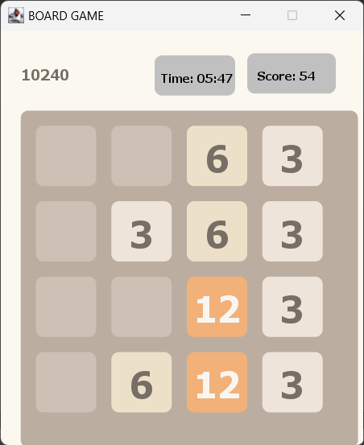

# 3072 Game

This repository contains a Java implementation of the popular 3072 game. The game is played on a grid where tiles with sum of 3 are randomly placed, and the player's goal is to combine these tiles to create one with the value of 3072.

## Features

- **Dynamic Board Size:** The game board can be configured to any desired size, offering flexibility in gameplay.
- **Swipe Controls:** Movement within the game is facilitated through swipe controls, enabling players to shift tiles in four directions: up, down, left, and right.
- **Tile Merging:** When two tiles with the same value collide, they merge into one, creating a new tile with double the value. This mechanic is central to achieving higher scores and progressing in the game.
- **Game Over Detection:** The game detects when the player has achieved victory by reaching the 3072 tile or when there are no possible moves left, signaling the end of the game.
- **Scoring System:** Players earn points by merging tiles, with higher values resulting in increased scores. The game keeps track of the player's score throughout the gameplay session.

## How to Play

To play the game, simply run the Java program, and a grid representing the game board will be displayed. Use the keyboard arrow keys or swipe gestures (depending on the implementation) to move the tiles in the desired direction. The game will continue until either the player achieves the 3072 tile or no further moves are possible.

## Getting Started

To get started with this implementation, follow these steps:

1. **Clone the Repository:** Clone this repository to your local machine using Git.
2. **Compile the Code:** Compile the Java files using a Java compiler such as `javac`.
3. **Run the Program:** Execute the compiled Java program to start playing the game.

## Contributions

Contributions to this project are welcome! If you have any suggestions for improvements, bug fixes, or additional features, feel free to open an issue or submit a pull request.

## License

This project is licensed under the [MIT License](LICENSE), allowing for unrestricted use, modification, and distribution.
